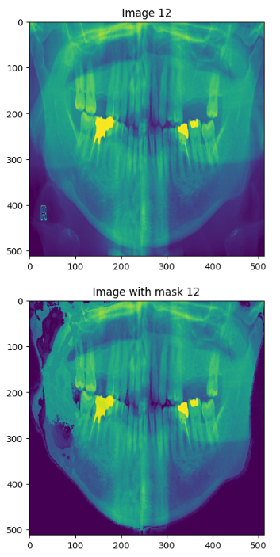
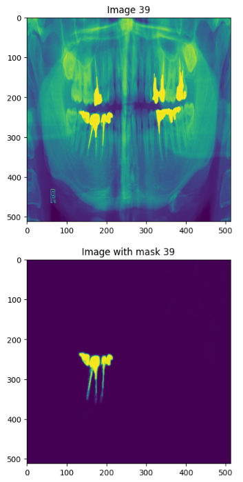
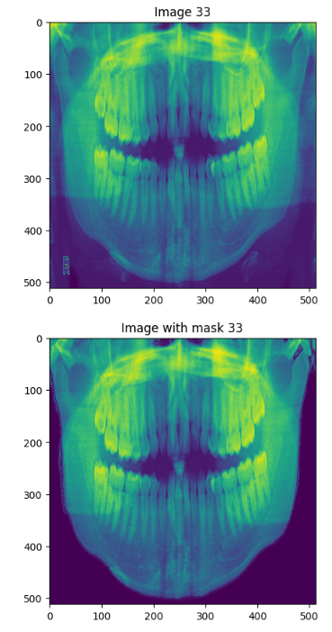
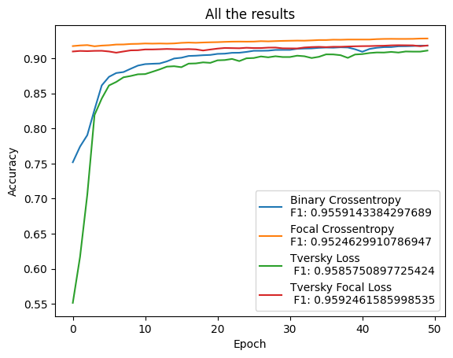
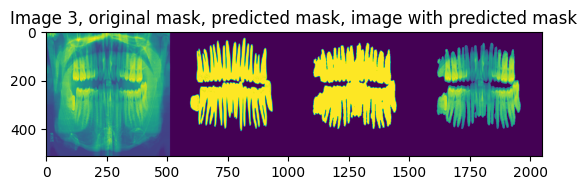
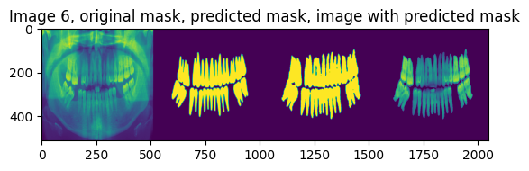
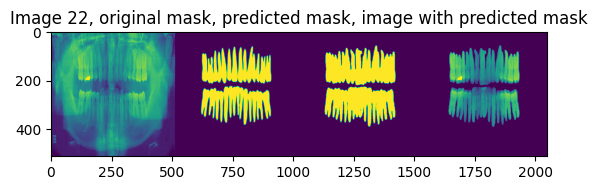

# <strong>Dental Data</strong>

## <em><strong>Requirements</strong></em>

### <strong>Purpose</strong>
Identification of teeth and lesions in dental images.

### <strong>Basic Idea</strong>
The automatic processing of dental medical images can be very useful for both doctors and patients. The identification of teeth and lesions in these images is the basis for the development of automatic dental health screening applications.

### <strong>Tasks</strong>
#### <em>First Iteration</em>
- data analysis
- segmentation of interest areas (mandible, teeth) with help of pre-trained models: <a href="https://github.com/deepmedic/deepmedic">DeepMedic</a>, <a href="https://github.com/xuebinqin/U-2-Net">U2net</a>, <a href="https://github.com/tensorflow/models/tree/master/research/deeplab">DeepLab</a>
- segments evaluation

#### <em>Second Iteration</em>
- training segmentation models based on CNN and graphs [<a href="http://ir.ia.ac.cn/bitstream/173211/40611/1/CNN-G%20Convolutional%20Neural%20Network%20Combined.pdf">link</a>] of interest areas specific to dental medical data, and the study of different loss functions [<a href="https://github.com/JunMa11/SegLoss">link</a>]
- segments evaluation
- comparing the approach from iteration 1 with the approach from iteration 2

### <strong>Data</strong>
- images with segmented <a href="https://data.mendeley.com/datasets/hxt48yk462/1">mandible</a> and <a href="https://github.com/SerdarHelli/Segmentation-of-Teeth-in-Panoramic-X-ray-Image-Using-U-Net">tooth</a>
- spectral images and their masks <a href="https://sites.uef.fi/spectral/odsi-db/">here</a>

## <em><strong>Pretrained Model</strong></em>
The used pretrained model was <a href="https://github.com/xuebinqin/U-2-Net">U2net</a>, a general purpose model used for removing the background from photos.

The obtained results were not that great because the model was not trained to solve this problem and it didn't really "know" what to segment.

<table width="100%">
    <tr width="100%">
        <td></td>
        <td></td>
        <td></td>
    </tr>
</table>

## <em><strong>Trained Model</strong></em>
A similar approach to <a href="https://github.com/SerdarHelli/Segmentation-of-Teeth-in-Panoramic-X-ray-Image-Using-U-Net">this one</a> was done for this iteration, so a U-net architecture was used and the data was augmented before training the model (due to the lack of data).

There were used 4 loss functions for the training process:
- binary cross-entropy loss
- focal cross-entropy loss
- Tversky loss
- Tversky focal loss

The difference in speed between the loss functions in the training process was negligible, as well as the F1 score, but the accuracies across epochs were a bit different.

The results were better than those obtained in the last iteration, mainly because the model was trained to predict the masks containing the teeth (specific to this problem).

## <em><strong>Bibliography</strong></em>
- Jader, G., Fontineli, J., Ruiz, M., Abdalla, K., Pithon, M., & Oliveira, L. (2018, October). Deep instance segmentation of teeth in panoramic X-ray images. In 2018 31st SIBGRAPI Conference on Graphics, Patterns and Images (SIBGRAPI) (pp. 400-407). IEEE.
- Lu, Y., Chen, Y., Zhao, D., Liu, B., Lai, Z., & Chen, J. (2020). CNN-G: Convolutional neural network combined with graph for image segmentation with theoretical analysis. IEEE Transactions on Cognitive and Developmental Systems, 13(3), 631-644.
- https://github.com/SerdarHelli/Segmentation-of-Teeth-in-Panoramic-X-ray-Image-Using-U-Net
- https://github.com/xuebinqin/U-2-Net
- https://github.com/JunMa11/SegLoss